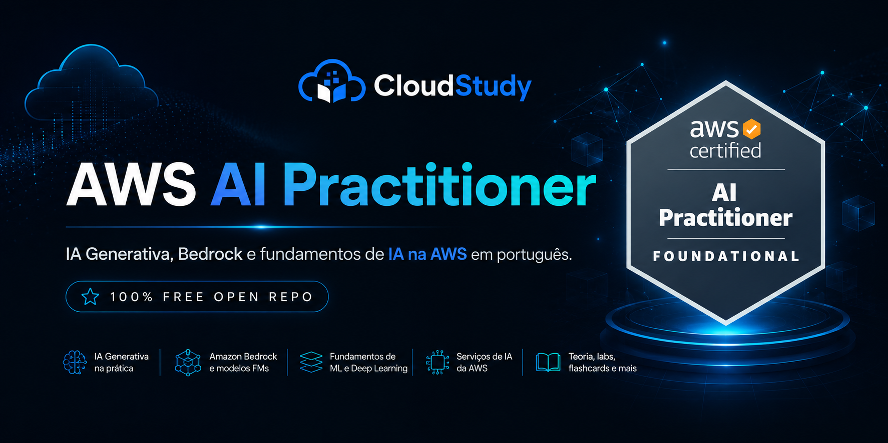



  

  
  &nbsp;&nbsp;&nbsp;
  

  

<h1 align="center">AWS AI Practitioner (AIF-C01) | Brasil</h1>

  Base open source em PT-BR para fundamentos de IA na AWS com navegação premium e trilha de evolução.

  
  
  
  

  
  
  

---

## Visão Geral

Este repositório organiza os fundamentos de IA e IA generativa na AWS em módulos objetivos, com foco em leitura progressiva, revisão rápida e prática guiada. A proposta pública prioriza clareza e consistência para quem está iniciando no escopo do exame AIF-C01.

| Bloco | O que você encontra |
|---|---|
| Fundamentos | Conceitos de IA, ML, inferência, LLMs e base da certificação |
| Serviços de IA AWS | Bedrock, SageMaker, serviços especializados e integração com aplicações |
| Responsible AI e Segurança | Governança, conformidade, privacidade, revisão humana e controles essenciais |
| Revisão | Simulados curtos, questões comentadas, glossário e material de fixação |
| Apoio | Cheatsheets, flashcards, labs guiados e recursos complementares |

## Roadmap de Estudo

1. Módulos 01 a 05: fundamentos de IA/ML, IA generativa, LLMs e Bedrock.
2. Módulos 06 a 10: SageMaker, governança inicial, dados para IA e prompts.
3. Módulos 11 a 15: segurança, casos de uso, integração e otimização.
4. Módulos 16 a 18: consolidação, simulados, glossário e revisão final.

## Módulos

| # | Tema | Link |
|---|---|---|
| 01 | Introdução a IA e ML | [Abrir](./01-Introducao-IA-e-ML/README.md) |
| 02 | Fundamentos de IA Generativa | [Abrir](./02-Fundamentos-de-IA-Generativa/README.md) |
| 03 | Fundamentos de Machine Learning | [Abrir](./03-Fundamentos-de-Machine-Learning/README.md) |
| 04 | Modelos Fundacionais e LLMs | [Abrir](./04-Modelos-Fundacionais-e-LLMs/README.md) |
| 05 | Amazon Bedrock | [Abrir](./05-Amazon-Bedrock/README.md) |
| 06 | Amazon SageMaker | [Abrir](./06-Amazon-SageMaker/README.md) |
| 07 | IA Responsável e Governança | [Abrir](./07-IA-Responsavel-e-Governanca/README.md) |
| 08 | Dados para IA | [Abrir](./08-Dados-para-IA/README.md) |
| 09 | Engenharia de Prompts | [Abrir](./09-Engenharia-de-Prompts/README.md) |
| 10 | IA Generativa na AWS | [Abrir](./10-IA-Generativa-na-AWS/README.md) |
| 11 | Segurança e Conformidade em IA | [Abrir](./11-Seguranca-e-Conformidade-em-IA/README.md) |
| 12 | Casos de Uso e Arquiteturas | [Abrir](./12-Casos-de-Uso-e-Arquiteturas/README.md) |
| 13 | Serviços de IA da AWS | [Abrir](./13-Servicos-de-IA-da-AWS/README.md) |
| 14 | Integração com Aplicações | [Abrir](./14-Integracao-com-Aplicacoes/README.md) |
| 15 | Boas Práticas e Otimização | [Abrir](./15-Boas-Praticas-e-Otimizacao/README.md) |
| 16 | Simulados e Questões | [Abrir](./16-Simulados-e-Questoes/README.md) |
| 17 | Glossário | [Abrir](./17-Glossario/README.md) |
| 18 | Recursos e Links | [Abrir](./18-Recursos-e-Links/README.md) |

## Estudos Complementares AWS

- **Para revisar fundamentos de cloud:**
https://github.com/Thiago-code-lab/aws-certified-cloud-practitioner-brasil

- **Arquiteturas AWS complementares podem ser aprofundadas em:**
https://github.com/Thiago-code-lab/aws-certified-solutions-architect-associate-brasil

## Licença

MIT

